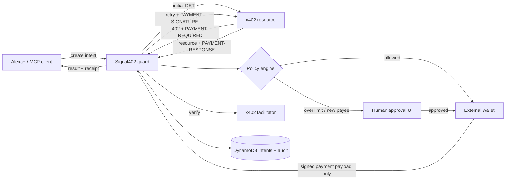
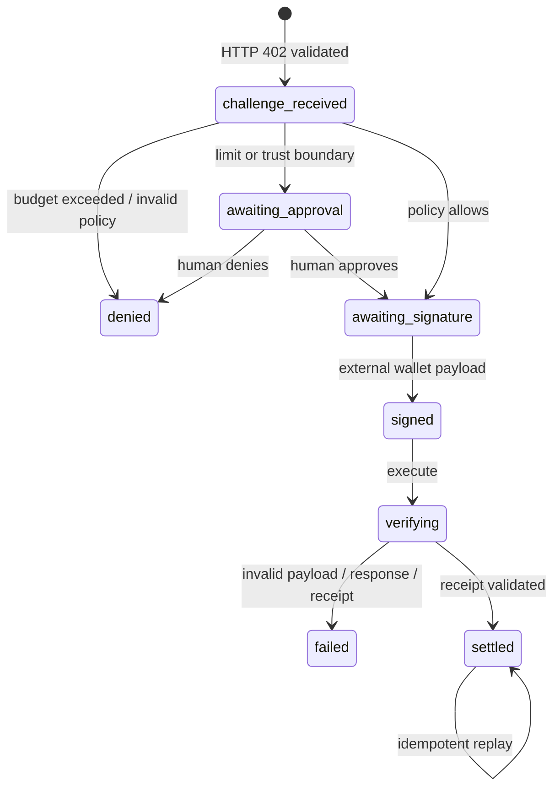

# Architecture and state machine

Signal402 is deliberately split across trust boundaries. Alexa+ can propose and
coordinate a purchase, but cannot silently gain custody of the user's wallet.

The MCP surface uses Streamable HTTP at `/mcp`. The same service exposes a small
REST API for the simulated Alexa+ experience. In production, App Runner keeps
the long-lived HTTP transport available and DynamoDB persists intent/audit data.

## State machine

The stored object begins directly in the post-policy state; the
`challenge_received` transition is still recorded conceptually during creation
and the validated challenge is immutable within the intent.

## Important implementation decisions

- Amounts are represented as bounded decimal numbers in the prototype. A mainnet
  adapter should use asset base units (`bigint`) before handling real value.
- The demo resource and facilitator are deterministic local adapters. HTTPS
  resources use the same state machine and hardened outbound fetcher.
- A wallet adapter must create the payment payload client-side. Signal402 stores
  it only until execution, audits a digest, then removes the original.
- Audit records include the previous record hash. DynamoDB point-in-time recovery
  protects availability; a production system can anchor periodic roots on-chain.
